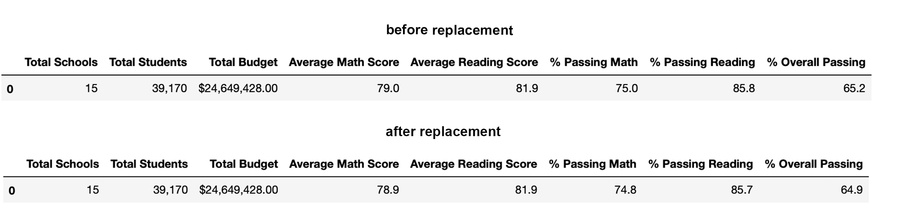
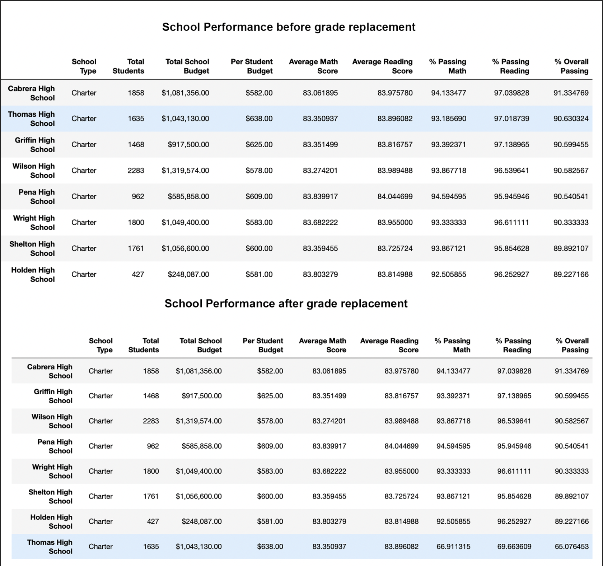

# School_District_Analysis

## Overview 
Following evidence of academic dishonesty we have to take a closer look at our analysis. In particular, Thomas High School ninth grade scores for reading and math
have been altered. Our objective is first to evaluate the extent of this dishonesty and to better understand it. This update analysis replaces the scores in question and evaluates how the changes we implement affect the overall analysis. 

## Results

### > Impact on district summary

- Average math score dropped by 0.1 point
- Average percentage passing math fell by 0.2% . 
- Average reading score remains unaffected. 
- Average percentage of students passing reading drops by 0.1% .

### > Impact on school summary 
- 

### > Impact on School Performance
Replacing math and reading scores for ninth graders at Thomas High School pushes math, reading and overall passing percentages upwards by around 30% in each category and lifts Thomas High School to second best in performance. 

